<!-- Replace this with your animated SVG once you make it -->

# Hey, I'm Zachary Scott 👋

### Brisbane-based hobbyist software developer

*“We learn by doing.”* — **John Dewey**

I build experimental web experiences, creative tools, and Python projects because I believe the fastest way to learn is to make things.

[Portfolio](https://zescott.com) • [Projects](https://github.com/ZacharyScottDeveloper?tab=repositories)

---

## My Philosophy

That single quote pretty much sums up how I approach programming.

I don't learn by collecting certificates or watching ten-hour tutorials—I learn by building. Every project starts with an idea I'm excited about, followed by a lot of experimenting, breaking things, fixing them, and eventually understanding *why* they work.

For me, software is less about memorising languages and more about creating experiences that people genuinely enjoy using.

## Featured Projects

<table>
<tr>
<td width="50%">

### 🤖 Virtual Roomba

An autonomous vacuum simulation built in Python featuring navigation, collision logic, and custom house layouts.

</td>
<td width="50%">

### 🎨 Pixel Art Maker

A Python tool that converts ordinary images into stylised pixel art with adjustable scaling.

</td>
</tr>
<tr>
<td width="50%">

### 🌐 zescott.com

My personal portfolio where I showcase projects and experiment with interactive web design.

</td>
<td width="50%">

### ⚡ More Projects

I'm always building something new—usually weird, experimental, or both.

</td>
</tr>
</table>

---

## Tech I Like Working With

  

| JavaScript | Python | Web Development |
|------------|--------|-----------------|
| Interactive UI | Creative tools | Experimental UX |

---

## Beyond the Code

I love building things that feel *alive*.

Whether it's a satisfying animation, a strange interaction, or a tool that solves a tiny problem in a fun way, I'm always chasing ideas that make software memorable.

Most of my projects begin with curiosity rather than necessity. If I find a concept I don't understand, I usually build something with it until I do.

---

### Currently Building

Experimental interfaces • Creative coding • Web projects

> **Build. Break. Learn. Repeat.**

